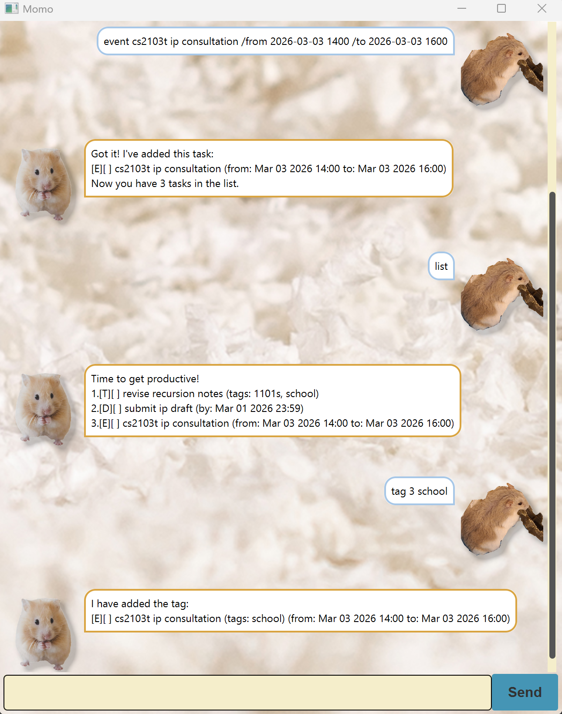

# Momo User Guide
> “Tiny paws, big productivity. Run the wheel, get things done.”  
> — *Some hamster, probably*

**Momo** is a Graphical User Interface (GUI) hamster-themed task management chatbot designed to help you manage your todos, deadlines, events, and tags efficiently.

Whether you're juggling school, projects, or daily commitments, Momo keeps everything organized and stored — even after you close the app.

<p align="center">
  
</p>

# Quick Start

1. **Ensure you have Java 17 installed** on your computer.  
2. **Download the latest `momo.jar`** from the release page.
3. **Copy the file** to the folder you want to use as the home folder for Momo.
4. **Open a command terminal**, `cd` into the folder containing the jar file, and run: `java -jar momo.jar`
5. **Begin** talking to Momo using the commands listed in [Command Summary](#command-summary)

# Command Summary

| Action | Command | Format |
|----------|--------|--------|
| List all tasks| list | `list` |
| Add a todo task | todo | `todo <description>` |
| Add a deadline task | deadline | `deadline <description> /by <yyyy-mm-dd HHmm>` |
| Add an event task | event | `event <description> /from <yyyy-mm-dd HHmm> /to <yyyy-mm-dd HHmm>` |
| Mark a task | mark | `mark <task number>` |
| Unmark a task | unmark | `unmark <task number>` |
| Delete a task | delete | `delete <task number>` |
| Find task by keyword | find (keyword) | `find <keyword>` |
| Find task by tag | find (tag) | `find #<tag>` |
| Tag a task | tag | `tag <task number> <tag1,tag2,...>` |
| Untag a task | untag | `untag <task number> <tag>` |
| Exit | bye | `bye` |

# Features
> **Notes about the command format:**
> * The `/by`, `/from` and `/to` fields accept the following formats:
>   * yyyy-mm-dd HHmm
>   * yyyy-mm-dd
> * Commands must follow parameter order.
> * Words in `< >` are parameters supplied by the user.

### 1. List all tasks

Shows a list of all your current tasks.

Format: `list`

Expected Output:
```
Time to get productive!
1. [T][ ] revise recursion notes
2. [D][ ] submit ip draft (by: Mar 01 2026 23:59)
3. [E][ ] cs2103t ip consultation (from: Mar 03 2026 14:00 to: Mar 03 2026 16:00)
```

### 2. Add a todo task

Adds a todo task.

Format: `todo <description>`

Example: `todo revise recursion notes`

Expected Output:
```
Got it! I've added this task:
[T][ ] revise recursion notes
Now you have 1 task in the list.
```

### 3. Add a deadline task

Adds a deadline task with a due date.

Format: `deadline <description> /by <yyyy-mm-dd HHmm>`

Example: `deadline submit ip draft /by 2026-03-01 2359`

Expected Output:
```
Got it! I've added this task:
[D][ ] submit ip draft (by: Mar 01 2026 23:59)
Now you have 2 tasks in the list.
```

### 4. Add an event task

Adds an event task with a start and end date.

Format: `event <description> /from <yyyy-mm-dd HHmm> /to <yyyy-mm-dd HHmm>`

Example: `event cs2103t ip consultation /from 2026-03-03 1400 /to 2026-03-03 1600`

Expected Output:
```
Got it! I've added this task:
[E][ ] cs2103t ip consultation (from: Mar 03 2026 14:00 to: Mar 03 2026 16:00)
Now you have 3 tasks in the list.
```

### 5. Mark a task

Marks a task as completed.

Format: `mark <task number>`

Example: `mark 2`

Expected Output:
```
Yipee!I've marked this task as done:
[D][X] submit ip draft (by: Mar 01 2026 23:59)
```

### 6. Unmark a task

Marks a task as not completed.

Format: `unmark <task number>`

Example: `unmark 2`

Expected Output:
```
OK, I've marked this task as not done yet:
[D][ ] submit ip draft (by: Mar 01 2026 23:59)
```

### 7. Delete a task

Deletes a task from the list.

Format: `delete <task number>`

Example: `delete 3`

Expected Output:
```
Noted. I've removed this task:
[E][ ] cs2103t ip consultation (from: Mar 03 2026 14:00 to: Mar 03 2026 16:00)
Now you have 2 tasks in the list.
```

### 8. Tag a task

Adds a tag to a task.

Format: `tag <task number> <tag1,tag2,...>`

Example: `tag 1 school,1101s`

Expected Output:
```
I have added the tag:
[T][ ] revise recursion notes (tags:1101s,school)
```

### 9. Untag a task

Removes a tag from a task.

Format: `untag <task number> <tag>`

Example: `untag 1 school`

Expected Output:
```
I have removed the tag:
[T][ ] revise recursion notes (tags:1101s)
```

### 10. Find tasks by keyword

Finds tasks containing a keyword.

Format: `find <keyword>`

Example: `find draft`

Expected Output:
```
Here are the matching tasks in your list
[D][ ] submit ip draft (by: Mar 01 2026 23:59)
```

### 11. Find tasks by tag

Finds tasks with a specific tag.

Format: `find #<tag>`

Example: `find #school`

Expected Output:
```
Here are the matching tasks in your list
[T][ ] revise recursion notes (tags:school)
[D][ ] submit ip draft (tags:school) (by: Mar 01 2026 23:59)
```

### 12. Exit the application

Closes the application.

Format: `bye`

Expected Output:
```
Bye ^-^ . Let's play again another time!
```


# Data Storage
* Momo automatically saves all tasks to a local storage file.
  * This file can be located at `data/momoTasks.txt` (created in the same directory as momo.jar)
* The storage file is created automatically upon first run.

**IMPORTANT NOTE:**
* Editing the storage file manually is not recommended.
* Invalid or corrupted entries may cause loading errors.
* If Momo is unable to launch due to corrupted data, delete `momoTasks.txt` and re-run the program